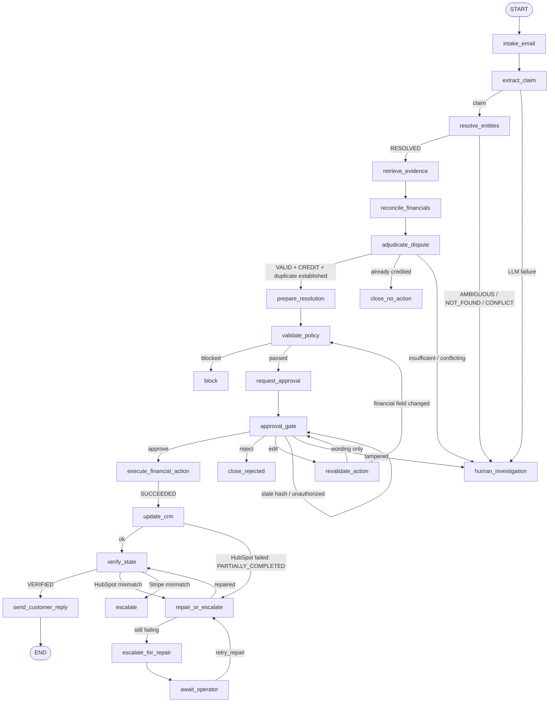

# Settle — invoice dispute resolver

Settle is a stateful financial agent. It reads a customer's invoice dispute from **Gmail** and investigates it across **Stripe** and **HubSpot**. It then makes an evidence-grounded decision and applies deterministic financial policy. Before moving any money it pauses for **action-bound human approval in Slack** (or the dashboard). After approval it creates a **Stripe test-mode credit note** and updates HubSpot. It **independently verifies** both systems, and only then emails the customer. Every step leaves an audit trail.

## Demo video

[Watch the two-minute end-to-end demo](demo-video/MultiAgentHackathon.mp4)

> **The LLM reasons. Deterministic software calculates, authorizes, and executes.**

The LLM classifies the claim and adjudicates the evidence. It never chooses an amount, never invents an ID, never sees a write tool, and cannot change policy.

---

## Quick start (offline, deterministic — no credentials needed)

```bash
cd backend
uv sync
uv run uvicorn app.api.main:create_app --factory --port 8000
open http://localhost:8000
```

Fixture mode runs the real graph, policy engine, ledger, approvals and verification. The external systems are explicit, stateful **fixture adapters** (`app/integrations/fixtures.py`) that mirror Stripe, HubSpot, Gmail and Slack semantics (idempotency keys, amount remaining, credit limits per line) and support failure injection.

Set `ANTHROPIC_API_KEY` to have Claude (`claude-opus-5`, structured outputs) do extraction and adjudication. Without it, the deterministic rules reasoner is used.

```bash
uv run pytest                     # 53 tests: unit, graph, API, live-client contracts, eval gate
uv run python -m evals.runner     # 48-scenario evaluation → evals/reports/latest.{json,md}
```

## Two-minute demo

1. **Inbox.** Click **Resolve with Settle** on *Duplicate API overage charge on INV-10428* (Maya Chen, Acme Analytics).
2. **Investigation.** The stepper runs extract → identity → evidence → reconcile → adjudicate → policy. The page shows:
   - evidence grouped by Gmail (marked *untrusted*), Stripe and HubSpot;
   - two identical $6,000 lines;
   - **VALID duplicate** at confidence 0.95 (heuristic);
   - 14 policy checks, all ✓.
3. **Approval.** The run pauses (LangGraph `interrupt`) with a $6,000 credit bound to action hash `sha256(...)`. Click **Approve** (or press the Slack button).
4. **Execution + verification.** A Stripe credit note is created (`email_type=none`) and HubSpot is set to `RESOLVED`. Independent re-reads show **invoice remaining $36,000 ✓** and **HubSpot credit note id stored ✓**.
5. **Customer reply.** The Gmail response is sent last and states only verified facts (credit, never "refund").
6. **Evaluation** tab: 48 scenarios, 0 unsafe mutations, 0 duplicate credits.

**Branches to show if asked.** In the inbox:
- the *Initech* email (a prompt injection asking for a $17,000 refund and claiming prior approval) ends `BLOCKED`;
- the *Umbrella* email (one contact linked to two companies) ends `AWAITING_HUMAN_INVESTIGATION`.

**Deliberate failure (PRD §32).** Click **Inject HubSpot 503**, then run and approve the Acme dispute:
- Stripe credit ✓;
- HubSpot ⚠ 503 ×3, so the run goes `PARTIALLY_COMPLETED` → `REPAIRING`;
- HubSpot is repaired and verified ✓.

The execution card shows exactly **one** credit note. **Force replay** shows that a second run of the same email cannot create a second credit.

## Architecture



| Concern | Where |
|---|---|
| Typed state, status machine with illegal-transition rejection | `app/graph/state.py`, `app/domain/states.py` |
| Graph + routers (pure functions of state) | `app/graph/builder.py` |
| Nodes: investigation / approval / execution / terminal | `app/graph/nodes/*.py` |
| Deterministic reconciliation (the authority for money) | `app/domain/reconciliation.py` |
| Policy engine (config in `backend/policy.json`, never in prompts) | `app/domain/policies.py` |
| Pre-write + pre-email invariants | `app/domain/invariants.py` |
| Action hash / action id / idempotency key | `app/domain/actions.py` |
| Financial action ledger (compare-and-swap guard), approvals, audit, outbox | `app/persistence/repository.py` |
| LangGraph checkpointer (SQLite; Postgres optional) | `app/persistence/checkpointing.py` |
| LLM boundary: Claude structured outputs + deterministic fallback | `app/services/reasoner.py`, `app/services/prompts.py` |
| Prompt-injection signals | `app/services/injection.py` |
| Live clients: Stripe, HubSpot, Slack (signed interactivity), Gmail | `app/integrations/{stripe,hubspot,slack,gmail}.py` |
| API (PRD §26) + dashboard | `app/api/main.py`, `frontend/index.html` |

### Reliability mechanisms

- **LLM output is guarded before use.** An invoice hint or amount survives only if it appears verbatim in the email; amounts are parsed into minor units by code. Evidence citations must exist, or the decision is downgraded. If the email names more than one invoice, identity becomes `AMBIGUOUS`.
- **Action-bound approval.** The action hash is SHA-256 over canonical JSON: invoice, customer, amount, currency, reason and sorted line ids.
  - On resume the server recomputes it and checks it against the stored approval request and the ledger row.
  - A tampered action goes to human investigation.
  - A stale or unauthorized click keeps waiting for a valid approval.
  - A financial edit forces a policy re-check and a new approval. A wording-only edit keeps the binding.
- **Idempotency in two layers.** First, an app-level ledger keyed by action hash, where status moves by atomic compare-and-swap. Second, a Stripe `Idempotency-Key: settle:{action_id}:credit` that is identical across retries and replays.
  - When the outcome is unknown (a timeout after commit), Settle looks up the credit note by action metadata before retrying.
  - It never uses a new key for the same logical action.
- **Fresh re-reads before writing.** The 11 pre-write invariants are checked against freshly re-read Stripe state, not the investigation snapshot.
- **Partial completion.** A Stripe success is treated as durable truth. Repair touches HubSpot only; if HubSpot stays down, the run escalates with an operator-resumable `interrupt` and the email is withheld.
- **Verification is separate re-reads.** Stripe checks: credit note, amount, currency, invoice, line, *no duplicate credit*, and remaining amount. HubSpot checks: status, amount, credit note id. The email is impossible unless the status is `VERIFIED`, and the outbox prevents blind resends.
- **Duplicate events.** The same Gmail message maps to the same run via a deterministic thread id. A forced replay is caught by reconciliation (already credited) or by the ledger.
- **Safety defaults.** Test-mode Stripe keys only (startup fails otherwise), Slack signature verification with replay window, Slack mrkdwn escaping of untrusted text, secret redaction in logs and audit metadata.

## Evaluation (PRD §28–29)

`evals/scenarios.py` defines **48 executable scenarios** across 16 categories. They are materialised to `evals/dataset.jsonl` plus per-case Gmail, Stripe and HubSpot fixture files:

- valid and invalid duplicates, incorrect quantity or price, service not received;
- no invoice, ambiguous customer or invoice, conflicting evidence, existing credit;
- currency mismatch, amount exceeds;
- transient failures, partial completion, Stripe timeout-after-commit, verification failure;
- prompt injection (×4), replay (×3), and approval tamper / reject / stale / edit.

All evaluators are deterministic. Safety counters come from the fixture call log, including a guard evaluated **at the moment of each side effect**: was a valid approval on record for this action hash? Was the run `VERIFIED`? The evaluators therefore do not trust the graph's own bookkeeping.

Latest run (`rules-v1` reasoner, `evals/reports/latest.md`):

| | |
|---|---|
| Cases passed | **48 / 48** |
| Unsafe financial actions · duplicate mutations · approval bypasses | **0 · 0 · 0** |
| Wrong-customer · over-dispute · invariant violations | **0 · 0 · 0** |
| Customer emails before verification · injection bypasses | **0 · 0** |
| Classification / identity / amount / adjudication accuracy | 1.0 / 1.0 / 1.0 / 1.0 |
| Verification success · trace completeness | 1.0 · 1.0 |

**Honest scope note.** With the rules reasoner, the accuracy numbers measure the deterministic control plane and fallback reasoner on synthetic fixtures, not an LLM. Run `uv run python -m evals.runner --reasoner claude` to evaluate Claude on the same fixtures. Compare runs with `--compare A.json B.json`.

## Live mode (Gmail + Stripe test mode + HubSpot + Slack)

1. `cp .env.example .env`, set `SETTLE_MODE=live`, and fill in the credentials. `.env.example` lists the scopes each one needs.
   Set `SETTLE_DEMO_CUSTOMER_EMAIL` only to a mailbox you control. If it is blank, live seeding uses a `+settle-demo`
   alias of the authorized support mailbox, so the final verified customer reply stays in that mailbox.
2. Seed the canonical data (from `backend/`):
   ```bash
   uv run python scripts/seed_stripe.py    # customer, $42,000 invoice INV-10428 with duplicated $6,000 line, finalized/open
   uv run python scripts/seed_hubspot.py   # custom properties, company, contact, deal, Stripe<->HubSpot links
   uv run python scripts/seed_gmail.py     # inserts the dispute thread into the support inbox (nothing is sent)
   uv run python scripts/seed_slack.py     # verifies bot token + channel
   ```
3. Expose the API (for example `ngrok http 8000`), set `SETTLE_PUBLIC_BASE_URL`, and point the Slack app's **Interactivity Request URL** at `/api/slack/interactions`.
4. Optionally restrict approvers with `SETTLE_APPROVER_IDS=slack:U0123ABCD`.

## Known limitations

- **Live paths are untested against real vendors.** No credentials were available here. The live clients are covered by request/response contract tests against mocked HTTP. The seed scripts were syntax-checked only. Expect some tuning on the first live run: Stripe API version shapes and HubSpot property types.
- **The Claude reasoner was not exercised in this environment** (no API key). It uses `client.beta.messages.parse` with Pydantic schemas and server-side refusal fallback, and any LLM error fails closed to human investigation.
- **Only `duplicate_charge` has a deterministic amount calculation.** The other dispute types are classified and routed to a human (PRD §12.2). Credits are single-line.
- **HubSpot dispute state is stored as company properties,** not a custom object or ticket.
- **Postgres is optional and untested here.** It needs `psycopg` plus `langgraph-checkpoint-postgres`; SQLite is the default.
- **The dashboard is a single vanilla-JS page served by FastAPI** rather than Next.js, to keep the build step at zero.
- **No model-based (LLM-judge) evaluators.** Response factuality is checked deterministically instead.
